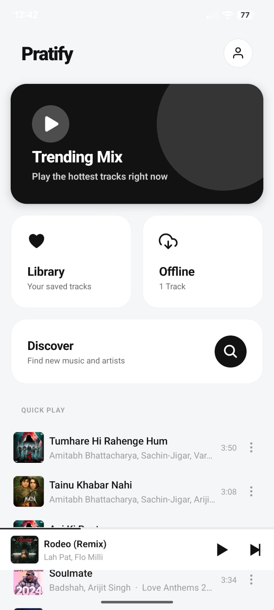

# Pratify 

A high-performance, full-stack music streaming application built with React Native and Expo. Pratify features a custom Digital Ocean backend, offline downloads, and seamless background audio playback.

### Screenshots

 

## Features

- **Custom Backend Integration**: Connects to a dedicated Digital Ocean server bypassing standard rate limits for lightning-fast music metadata and streaming.
- **Background Audio Engine**: Utilizes natively compiled `expo-av` for robust audio playback, even when the app is minimized or the screen is locked.
- **Advanced State Management**: Built with `Zustand` for instant UI updates, seamless custom queueing, and reliable playlist management.
- **Offline Mode**: Download songs directly to the device's local file system for offline listening without buffering.
- **Native Security Configuration**: Custom Android Manifest configurations to allow cleartext HTTP traffic to the private streaming backend.

## Tech Stack

- **Frontend:** React Native, Expo
- **Audio Engine:** Expo-AV (Native Module)
- **State Management:** Zustand
- **Backend:** Custom API hosted on Digital Ocean
- **Storage:** AsyncStorage & Expo FileSystem

## Local Development & Build Instructions

### Prerequisites
- Node.js (v18+)
- Android Studio / Android SDK
- A physical Android device (for testing native audio)

### 1. Clone & Install
```bash
git clone https://github.com/pratyushwinorlearn/pratify.git
cd pratify
npm install